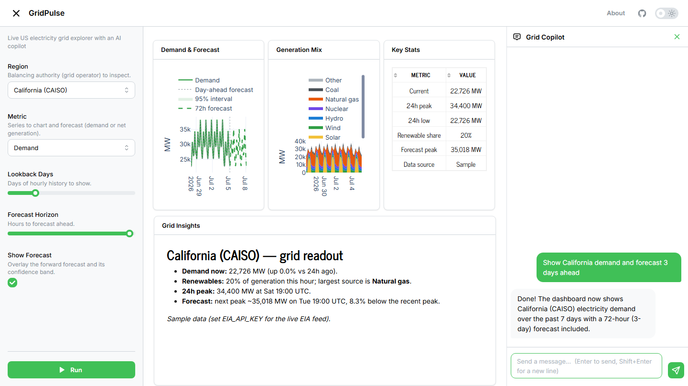

# ⚡ GridPulse

**A live US electricity-grid explorer with an AI copilot — built on [Fast Dash](https://github.com/dkedar7/fast_dash).**



<sub>Above: the copilot was asked *"Show California demand and forecast 3 days ahead"* — it set the region and forecast horizon and re-ran the app on its own.</sub>

Pick a grid operator and GridPulse charts its hourly demand, generation mix, and a short-term demand forecast with a confidence band. Then ask the **Grid Copilot** — *"compare California and Texas, and forecast the next 3 days"* — and watch the dashboard reconfigure itself and re-run. The controls flash, the charts refresh, and the copilot explains what changed.

The whole dashboard is **one typed Python function**. The copilot is a **LangGraph agent on OpenRouter** mounted as a Fast Dash sidecar that drives those same controls — anything you can do, it can do.

<!-- Demo GIF goes here once recorded against the live app -->
<!--  -->

## The whole app is this function

```python
def explore(
    region: RegionLit = "Texas (ERCOT)",          # -> dropdown (8 grid operators)
    metric: MetricLit = "Demand",                 # -> dropdown
    lookback_days: Annotated[int, range(1, 31)] = 7,     # -> slider
    forecast_horizon: Annotated[int, range(6, 73)] = 48, # -> slider
    show_forecast: bool = True,                   # -> switch
):
    """Explore a US grid region's demand, generation mix, and short-term forecast."""
    demand = load_demand(region, lookback_days)
    fuel   = load_fuel_mix(region, lookback_days)
    fc     = forecast_demand(demand["demand"], forecast_horizon)
    return demand_figure(...), mix_figure(...), stats_table(...), insights(...)
```

Fast Dash infers the dropdowns, sliders, switch, layout, and chat sidecar from the type hints and docstring. No callbacks, no HTML.

## How the copilot drives the app

The copilot is a LangGraph `create_react_agent` whose model is OpenRouter (via `langchain-openai`, pointed at `https://openrouter.ai/api/v1`). It has two tools — `set_input` and `run_app` — described from the app's live input contract, so it always knows the valid regions, metrics, and slider bounds. A thin wrapper streams its reasoning as chat text and translates each tool call into a Fast Dash **drive frame**, so the inputs visibly flash and the charts refresh:

```
you  ▸ show me Texas net generation and forecast 60 hours
        set_input(region="Texas (ERCOT)")     ← input flashes
        set_input(metric="Net generation")    ← input flashes
        set_input(forecast_horizon=60)         ← slider moves
        run_app()                              ← charts refresh
copilot ▸ Texas net generation over the past week, with a 60-hour forecast…
```

## Data

Hourly demand, day-ahead demand forecast, net generation, and generation-by-fuel come from the **US EIA v2 API** (Form EIA-930, Hourly Electric Grid Monitor). With no `EIA_API_KEY` set, GridPulse falls back to a physically plausible **sample** series anchored to the current time, so it runs anywhere — clearly labelled as sample data in the UI. *The forecast is an illustrative Holt-Winters statistical model, not a production grid forecast.*

## Run locally

```bash
uv sync
uv run python -m gridpulse            # http://127.0.0.1:8080
```

Runs on sample data with an offline keyword-driving copilot. For the live feed and the full AI copilot:

```bash
export EIA_API_KEY=...          # free: https://www.eia.gov/opendata/register.php
export OPENROUTER_API_KEY=...   # https://openrouter.ai/keys
```

Optional: `GRIDPULSE_MODEL` (default `anthropic/claude-haiku-4.5`).

## Deploy to Fly.io

```bash
fly launch --no-deploy          # or `fly apps create gridpulse`
fly secrets set OPENROUTER_API_KEY=... EIA_API_KEY=...
fly deploy
```

Served by gunicorn (gthread, single worker) so the sidecar's chat history and socket.io session live in one process. See `Dockerfile` and `fly.toml`.

## Architecture

| File | Role |
| ---- | ---- |
| `gridpulse/app.py` | The typed `explore()` callback + Fast Dash wiring |
| `gridpulse/agent.py` | LangGraph + OpenRouter copilot; tool-call → drive-frame translation; guardrails |
| `gridpulse/data.py` | EIA v2 client + wall-clock-anchored sample fallback |
| `gridpulse/forecast.py` | Holt-Winters demand forecast with confidence bands |
| `gridpulse/charts.py` / `insights.py` | Plotly figures and the auto-generated readout |

Guardrails on the public LLM endpoint: per-session turn cap, a daily budget, and an input-length cap.

## Tech stack

Fast Dash · Dash / Plotly · LangGraph · LangChain (OpenRouter) · statsmodels · pandas · EIA v2 API · Fly.io

## License

MIT — see [LICENSE](LICENSE).
